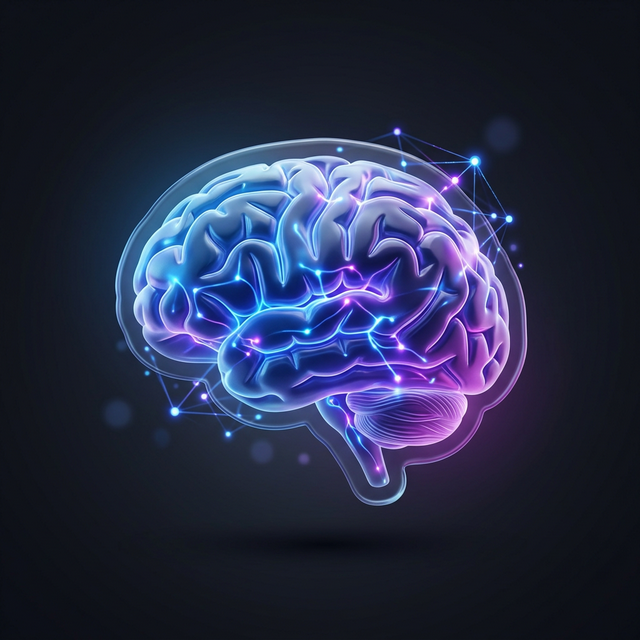
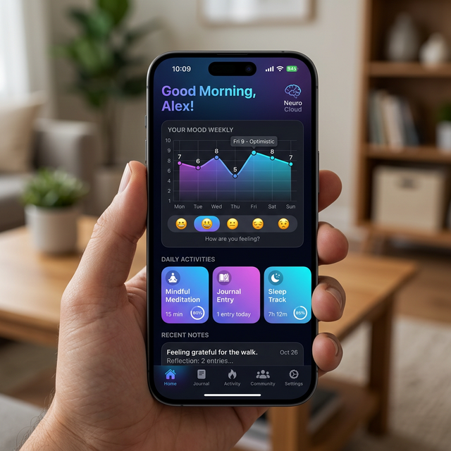
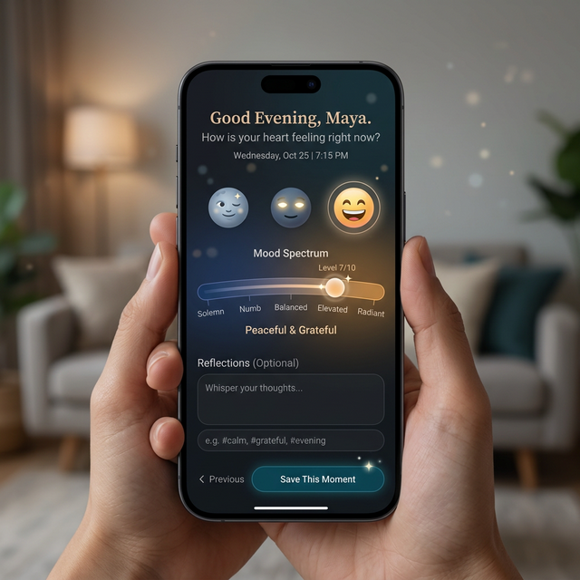
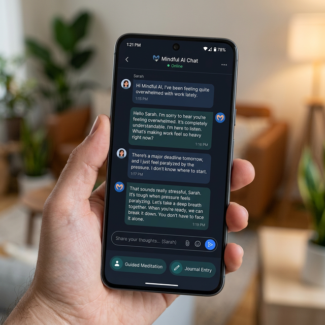
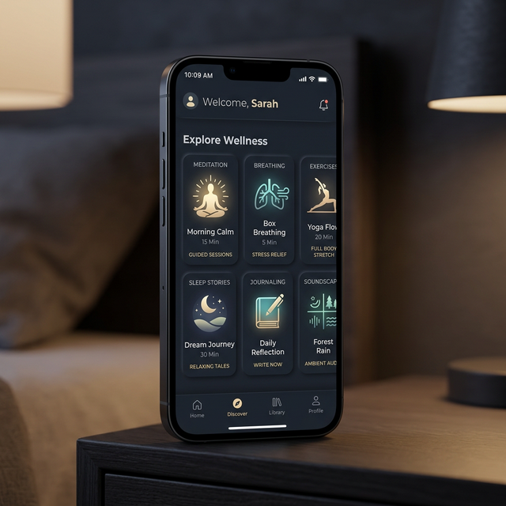

<div align="center">
  

  # 🧠 Neuro Cloud

  *A modern mental wellness & mood tracking Android application built with Jetpack Compose.*

  [](https://kotlinlang.org)
  [](https://developer.android.com/jetpack/compose)
  [](https://firebase.google.com/)
  [](https://android-arsenal.com/api?level=24)
  [](#-license)

  **[Live Demo](https://neurocloud.netlify.app)** | **[Report a Bug](#)** | **[Request Feature](#)**
</div>

---

## 📖 Table of Contents
- [About the Project](#-about-the-project)
- [Key Features](#-key-features)
- [Screenshots](#-screenshots)
- [Tech Stack](#-tech-stack)
- [Architecture & Structure](#-architecture--structure)
- [Getting Started](#-getting-started)
- [Permissions](#-permissions)
- [Contributing](#-contributing)
- [License](#-license)

---

## 💡 About the Project

**Neuro Cloud** is a comprehensive mental health companion designed to help users track their moods, gain insights into their emotional well-being, and engage with therapeutic activities. The application leverages modern Android development practices, ensuring a fluid, responsive, and secure user experience.

Whether logging daily emotions, exploring curated mindfulness exercises, or chatting with an AI assistant for mental support, Neuro Cloud provides a safe and private space for personal growth.

---

## ✨ Key Features

- 📊 **Advanced Mood Tracking:** Log your daily mood with quantified scores and personal notes. Visualize historical trends with interactive charts.
- 🤖 **AI Assistant:** Real-time conversational AI designed to provide mental wellness guidance and support.
- 📈 **Insights Dashboard:** Get at-a-glance daily and weekly mood averages, alongside activity completion metrics.
- 📑 **Automated Reports:** Generate comprehensive mood reports seamlessly in the background using `WorkManager`.
- 🧘 **Pro Activities:** Access a curated library of wellness activities, breathing exercises, and mindfulness routines.
- 🔐 **Robust Security:** Secure access via Google Sign-In and local Biometric/Fingerprint authentication integrations.
- 🎨 **Modern UI/UX:** Built entirely with Jetpack Compose featuring a beautiful, dynamic Dark Theme and smooth animations.

---

## 📸 Screenshots

| Dashboard | Mood Tracking | AI Chat | Pro Activities |
|:---:|:---:|:---:|:---:|
|  |  |  |  |

*(Note: Replace placeholder images with actual app screenshots in the `screenshots/` directory)*

---

## 🛠️ Tech Stack

Neuro Cloud is built on a modern Android technology stack:

### Core Layer
- **Language:** [Kotlin](https://kotlinlang.org/)
- **UI Toolkit:** [Jetpack Compose](https://developer.android.com/jetpack/compose) with Material 3 Design
- **Navigation:** [Navigation Compose](https://developer.android.com/jetpack/compose/navigation)
- **Image Loading:** [Coil](https://coil-kt.github.io/coil/compose/)

### Data & Backend
- **Cloud Database:** [Firebase Firestore](https://firebase.google.com/products/firestore)
- **Local Storage:** SQLite via core `DatabaseHelper`
- **Authentication:** Firebase Auth, Google Sign-In API, Android Biometric API

### Background Processing
- **WorkManager:** For robust, deferred, and guaranteed background task execution (e.g., Report Generation).

---

## 🏗️ Architecture & Structure

The codebase is structured by feature to ensure scalability and maintainability:

```text
app/src/main/java/fm/mrc/cloudassignment/
├── MainActivity.kt              # Main entry point & Navigation host
├── NeuroCloudApplication.kt     # App instance for global initializations
├── auth/                        # Authentication flows & integrations
├── components/                  # Reusable UI components (BottomNav, TopBar)
├── data/                        # Data models and Local SQLite helpers
├── navigation/                  # App routing and deep links
├── screens/                     # Individual UI screens (Home, Track, Chat, etc.)
├── ui/theme/                    # Design system (Colors, Typography, Themes)
└── workers/                     # WorkManager classes for background tasks
```

---

## 🚀 Getting Started

Follow these steps to set up the project locally.

### Prerequisites
- **Android Studio** Hedgehog (2023.1.1) or newer.
- **JDK 11+**
- A **Firebase Project** with configured:
  - Authentication (Google & Email)
  - Cloud Firestore

### Installation

1. **Clone the repository:**
   ```bash
   git clone https://github.com/N3Edirisinghe/Neuro-Cloud-Mood-Tracking-Application.git
   cd cloudassignment
   ```

2. **Configure Firebase:**
   - Register your Android app in your Firebase Console.
   - Download the generated `google-services.json` file.
   - Place this file in the `app/` directory of the project.

3. **Build the Project:**
   - Open the project in Android Studio.
   - Allow Gradle to sync dependencies.
   - Build the project (`Build > Make Project`).

4. **Run the App:**
   - Select your target device/emulator.
   - Click Run (▶️).
   - *Requires Min SDK: API 24 (Android 7.0)*

---

## 🔐 Permissions Overview

The app requests only the permissions necessary for its core features:

| Permission | Usage |
|---|---|
| `CAMERA` | Take photos to update the user's profile picture. |
| `RECORD_AUDIO` | Support for voice input within the tracking inputs. |
| `WRITE_EXTERNAL_STORAGE` | Save generated reports locally (Android 8.0 and below). |
| `USE_BIOMETRIC` | Enable secure login and app locking mechanisms. |
| `RECEIVE_BOOT_COMPLETED`| Reschedule background tasks (`WorkManager`) after device reboot. |
| `FOREGROUND_SERVICE` | Ensure reports are generated continuously in the background. |

---

## 🤝 Contributing

Contributions are what make the open-source community such an amazing place to learn, inspire, and create. Any contributions you make are **greatly appreciated**.

1. Fork the Project
2. Create your Feature Branch (`git checkout -b feature/AmazingFeature`)
3. Commit your Changes (`git commit -m 'Add some AmazingFeature'`)
4. Push to the Branch (`git push origin feature/AmazingFeature`)
5. Open a Pull Request

---

## 📄 License

This project is submitted as an academic assignment.

---
<div align="center">
  <i>Made with ❤️ for Mental Wellness</i>
</div>
